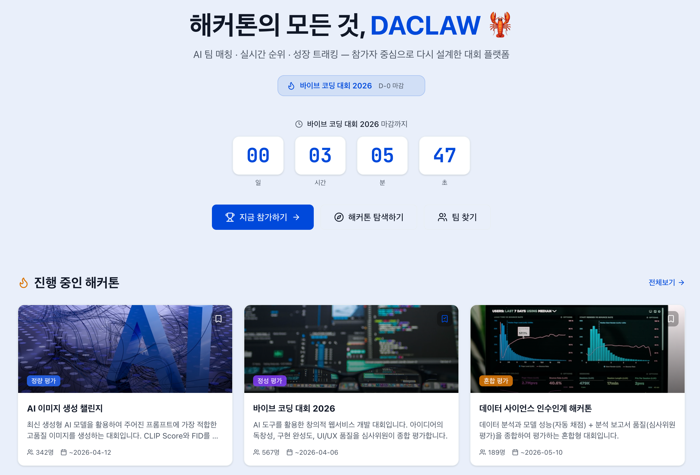
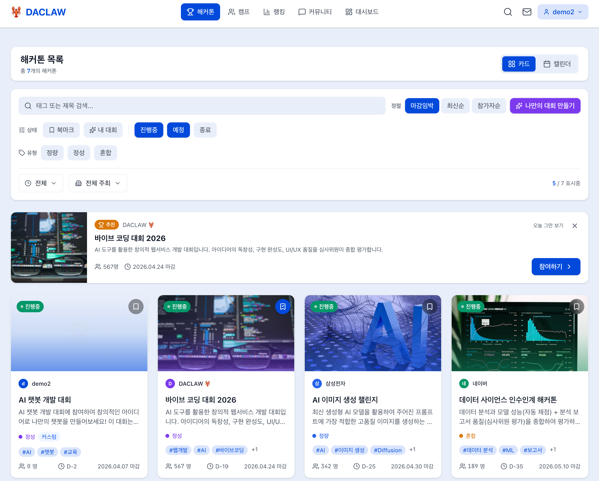
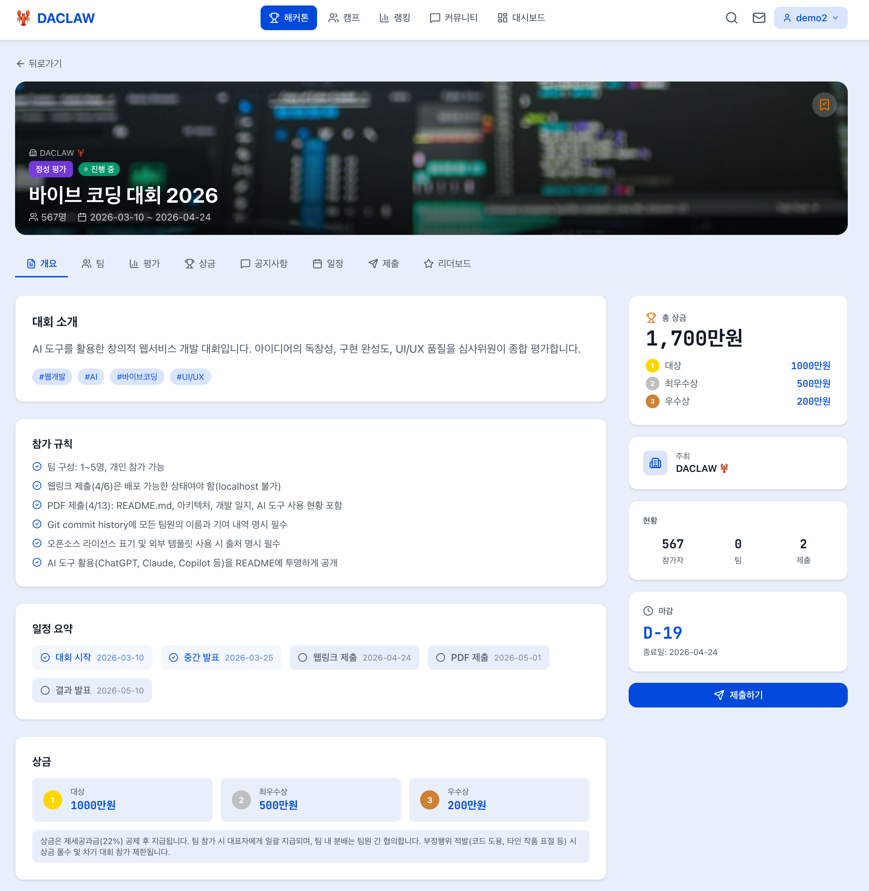
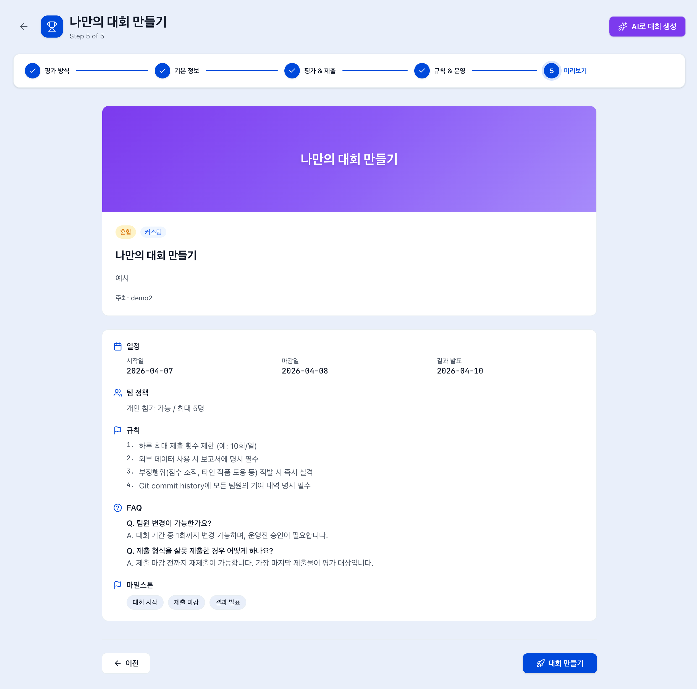
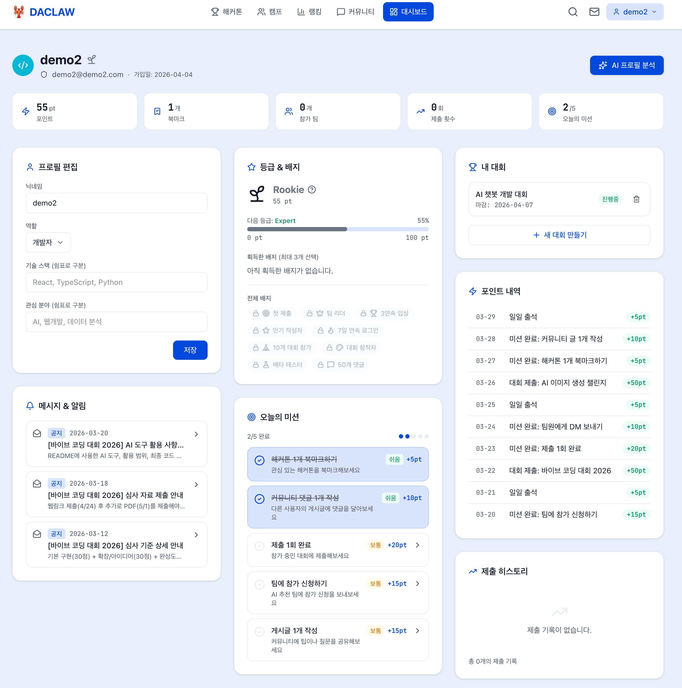

# DACLAW - 해커톤 올인원 플랫폼

해커톤 탐색부터 팀 매칭, 제출, 성장 추적, 대회 운영까지 -- 참가자와 운영자 모두를 위한 해커톤 플랫폼.

> **Dacon 바이브코딩 해커톤 출품작**
>
> 배포: https://daclaw.vercel.app/
>
> GitHub: https://github.com/chanmuzi/dacon-vibe-coding-claude

---

## 프로젝트 개요

DACLAW는 해커톤 참가자의 전체 여정을 지원하는 올인원 플랫폼입니다.

기존 해커톤 플랫폼은 대회 정보 나열에 그치지만, DACLAW는 **탐색 → 팀 빌딩 → 제출 → 성과 추적 → 대회 운영**의 전 과정을 하나의 서비스에서 제공합니다. 특히 4개의 AI 기능과 게이미피케이션 시스템으로 참가자의 몰입도를 높이고, "나만의 대회 만들기"로 누구나 대회 운영자가 될 수 있습니다.

### 핵심 차별점

| 차별점 | 설명 |
|--------|------|
| AI 통합 4종 | QA 챗봇, 프로필 기반 대회 추천, 팀 호환성 분석, 대회 생성 보조 |
| 나만의 대회 만들기 | 5단계 위자드 + AI 자동 생성으로 누구나 대회 운영 가능 |
| 게이미피케이션 | 등급(5단계) + 배지(10종) + 일일 미션(5개) + 포인트 시스템 |
| 실시간 제출/검증 | CSV/JSON/Markdown 파일 업로드 + 형식 자동 검증 + 리더보드 |
| 통합 커뮤니케이션 | 커뮤니티 게시판 + 1:1 DM + 팀 신청 알림 시스템 |

---

## 주요 화면

| 메인 페이지 | 해커톤 목록 |
|:-----------:|:----------:|
|  |  |
| 진행중 대회 카운트다운, 인기 대회, 커뮤니티 | 다중 필터, 카드뷰/캘린더뷰, 커스텀 대회 배지 |

| 대회 상세 | 나만의 대회 만들기 |
|:---------:|:----------------:|
|  |  |
| 개요, 규칙, 상금, 마일스톤, 제출, 리더보드 | 5단계 위자드 + AI 보조 생성 미리보기 |

| 대시보드 |
|:--------:|
|  |
| 프로필, AI 분석, 내 대회, 배지, 미션, 포인트 |

---

## 페이지 구성

15개 페이지 (동적 라우트 4개 포함)로 구성되어 있습니다.

| 페이지 | 경로 | 설명 |
|--------|------|------|
| 메인 | `/` | 진행중 대회 카운트다운, 인기 대회, 최신 커뮤니티, 팀 모집 현황 |
| 해커톤 목록 | `/hackathons` | 카드뷰/캘린더뷰 전환, 다중 필터(상태/유형/기간/주최자/커스텀), 정렬, 북마크 |
| 해커톤 상세 | `/hackathons/[slug]` | 개요, 규칙, 평가 기준, 상금, FAQ, 마일스톤, 공지사항, 제출, 리더보드, 토론 |
| 대회 비교 | `/compare` | 최대 3개 대회 동시 비교 (일정, 상금, 팀 정책, 평가 기준) |
| 대회 만들기 | `/create` | 5단계 위자드 + AI 보조 생성 (평가방식 → 기본정보 → 평가설정 → 규칙 → 미리보기) |
| 대시보드 | `/dashboard` | 프로필, AI 분석, 내 대회, 북마크, 제출 통계, 배지, 미션, 포인트 |
| 팀 캠프 | `/camp` | 팀 목록, 역할별 필터, 모집 상태, AI 팀 추천, 참가 신청 |
| 팀 상세 | `/teams/[id]` | 팀 정보, 멤버, 모집 역할, 참가 대회, 신청 관리 |
| 팀 생성 | `/teams/create` | 팀 생성 폼 (이름, 설명, 모집 역할, 기술 스택, 대회 선택) |
| 커뮤니티 | `/community` | 게시글 CRUD, 유형별 필터(질문/팁/팀찾기/자유), 좋아요, 댓글 |
| 프로필 | `/users/[id]` | 사용자 프로필, 활동 내역, 배지, 팀 소속 |
| 메시지 | `/messages` | 1:1 DM, 팀 신청 알림, 읽음 상태 관리 |
| 랭킹 | `/rankings` | 종합/대회/커뮤니티 랭킹, 등급별 분포 차트 |
| 모니터 | `/monitor` | 대회별 제출 현황, 통계 대시보드 |
| 에러/404 | `/error`, `/not-found` | 커스텀 에러 및 404 페이지 |

---

## 시스템 구성

```
┌─────────────────────────────────────────────────────┐
│                   사용자 (브라우저)                     │
└──────────────────────┬──────────────────────────────┘
                       │
┌──────────────────────▼──────────────────────────────┐
│              Next.js 16 App Router (CSR)            │
│                                                     │
│  ┌─────────────┐  ┌──────────────┐  ┌────────────┐  │
│  │  15 Pages   │  │ 24 Components│  │  8 Stores  │  │
│  │ (App Router)│  │ (UI Library) │  │ (Zustand)  │  │
│  └──────┬──────┘  └──────────────┘  └─────┬──────┘  │
│         │                                  │         │
│  ┌──────▼──────────────────────────────────▼──────┐  │
│  │           localStorage (영속 저장소)              │  │
│  │      시드 데이터 버전 관리 (SEED_VERSION)           │  │
│  │      커스텀 데이터 보존 (마이그레이션)                 │  │
│  └────────────────────────────────────────────────┘  │
│                                                      │
│  ┌────────────────────────────────────────────────┐  │
│  │              API Routes (4개)                   │  │
│  │  chat · analyze · recommend-teams              │  │
│  │  generate-hackathon                            │  │
│  └──────────────────────┬─────────────────────────┘  │
└─────────────────────────┼────────────────────────────┘
                          │
              ┌───────────▼───────────┐
              │  OpenAI gpt-4o-mini   │
              │  (Rate Limiting 적용)  │
              └───────────────────────┘
```

- **서버리스 아키텍처**: 별도 백엔드/DB 없이 localStorage + API Routes로 동작
- **시드 데이터 버전 관리**: `SEED_VERSION`으로 스키마 변경 시 자동 마이그레이션, 사용자 커스텀 데이터는 보존
- **디자인 시스템**: CSS 변수 기반 토큰 시스템 + Tailwind 유틸리티 ([docs/designsystem.md](docs/designsystem.md))
- **Rate Limiting**: IP 기반 요청 제한으로 API 남용 방지

---

## 핵심 기능 명세

### 1. 해커톤 탐색 및 참여

- **다중 필터**: 상태(진행중/예정/종료), 유형(정량/정성/혼합), 기간, 주최자, 커스텀 대회 필터
- **뷰 전환**: 카드뷰 / 캘린더뷰 (월별 대회 일정 시각화)
- **대회 비교**: 최대 3개 동시 비교 (일정, 상금, 팀 정책, 평가 기준)
- **북마크**: 관심 대회 저장 + 토스트 알림
- **상세 페이지**: 7개 탭 (개요, 규칙, 리더보드, 제출, 공지사항, FAQ, 토론)

### 2. 제출 시스템

- CSV/JSON/Markdown 형식 지원
- 파일 드래그 앤 드롭 업로드
- 실시간 형식 검증 (컬럼 수, 행 수, 파일 크기, 문자 수)
- 마크다운 미리보기 + KaTeX 수식 렌더링
- 버전 관리 (제출 이력 추적)
- 리더보드 실시간 순위 반영

### 3. 나만의 대회 만들기 (확장 기능)

- **5단계 위자드 UI**: 평가방식 선택 → 기본정보 → 평가/제출 설정 → 규칙/FAQ → 미리보기
- **AI 대회 생성 보조**: 제목/방식/일정만 입력하면 규칙, 평가기준, FAQ를 AI가 자동 생성
- **배너 커스터마이징**: 8종 그라데이션 팔레트 또는 이미지 URL
- **생성 제한**: 월 2회 (남용 방지)
- **관리 기능**: 대시보드에서 내 대회 목록 확인/삭제, 상세 페이지에서 삭제

### 4. AI 기능 (gpt-4o-mini, 4개 API 라우트)

| 기능 | API 경로 | 설명 |
|------|----------|------|
| QA 챗봇 | `/api/chat` | 대회별 컨텍스트(규칙, 평가기준) 기반 실시간 스트리밍 질의응답 |
| 프로필 분석 | `/api/analyze` | 사용자 역할/기술스택/등급 분석 → 맞춤 대회 추천 (결과 영속) |
| 팀 매칭 | `/api/recommend-teams` | 프로필-팀 호환성 분석 + 매치 점수(0-100) + 추천 이유 |
| 대회 생성 | `/api/generate-hackathon` | 자연어 입력 → 대회 설정 JSON 자동 생성 (2단계 확인) |

> AI 기능 없이도 모든 핵심 기능은 정상 동작합니다. API 키 미설정 시 안내 메시지를 표시합니다.

### 5. 팀 매칭 및 캠프

- 팀 생성/모집/신청 (역할별: 개발자, 디자이너, 기획자, 데이터 사이언티스트)
- AI 팀 추천 (기술스택 + 관심분야 매칭, 호환성 점수)
- 팀 신청 수락/거절 + 알림

### 6. 커뮤니티

- 게시글 유형: 질문, 팁, 팀 찾기, 자유
- 좋아요, 댓글, 검색/필터/정렬
- CRUD (본인 게시글/댓글 수정/삭제)

### 7. 게이미피케이션 시스템 (확장 기능)

- **등급 시스템**: Rookie → Challenger → Expert → Master → Legend (포인트 기반 자동 승급)
- **배지 시스템**: 업적/활동/특별 배지 10종 (대시보드에서 4개까지 선택 표시)
- **일일 미션**: 5개 미션 (북마크, 댓글, 제출, 팀 신청, 게시글 작성) + 포인트 보상
- **포인트 히스토리**: 활동별 포인트 적립 + 시계열 차트 시각화
- **랭킹**: 종합/대회/커뮤니티 분야별 랭킹 + 등급 분포 차트

### 8. 기타

- **통합 검색**: Fuse.js 퍼지 검색 (대회, 팀, 게시글, 사용자)
- **메시지 시스템**: 1:1 DM + 팀 신청 알림 + 읽음 상태
- **모니터링**: 대회별 제출 현황 대시보드
- **반응형 디자인**: 모바일 / 태블릿 / 데스크톱 대응
- **빈 상태 UI**: 데이터 없는 상태에서도 안내 메시지 + CTA 제공
- **에러 처리**: 커스텀 에러 페이지, 404 페이지

---

## 주요 사용 흐름

### 흐름 1: 해커톤 참가자

```
메인 페이지 → 해커톤 탐색 (필터/검색) → 대회 상세 확인
    → 북마크 저장 / 팀 찾기 (캠프)
    → 팀 생성 또는 참가 신청
    → 대회 제출 (파일 업로드 + 검증)
    → 리더보드 확인 → 대시보드에서 성과 추적
```

### 흐름 2: 대회 운영자

```
메인 페이지 → "나만의 대회 만들기"
    → 평가방식 선택 → 기본정보 입력 → 평가/제출 설정
    → 규칙/FAQ 작성 (또는 AI 자동 생성)
    → 미리보기 확인 → 대회 생성
    → 대시보드에서 내 대회 관리
```

### 흐름 3: AI 활용

```
대시보드 → AI 프로필 분석 → 맞춤 대회 추천 받기
캠프 → AI 팀 추천 → 호환성 점수 확인 → 팀 신청
대회 상세 → QA 챗봇으로 규칙/평가 질문
대회 만들기 → AI로 규칙/평가기준/FAQ 자동 생성
```

---

## 기술 스택

| 분류 | 기술 |
|------|------|
| 프레임워크 | Next.js 16 App Router / React 19 |
| 언어 | TypeScript |
| 스타일링 | Tailwind CSS v4 + tw-animate-css |
| 상태관리 | Zustand 5 (8개 스토어) |
| 차트 | Recharts |
| 검색 | Fuse.js (클라이언트 퍼지 검색) |
| 마크다운 | react-markdown + remark-gfm + rehype-katex |
| 아이콘 | Lucide React |
| AI | OpenAI gpt-4o-mini (4개 API 라우트) |
| 데이터 | localStorage 기반 mock (서버리스) |
| 배포 | Vercel |

---

## 프로젝트 구조

```
dacon-vibe-coding-claude/
├── docs/                          # 디자인 시스템, 참고 스크린샷
└── daclaw/                        # Next.js 앱 (Vercel root directory)
    ├── src/app/                   # 페이지 (15개, 동적 라우트 4개)
    │   ├── api/                   # API 라우트 (4개)
    │   │   ├── chat/              # QA 챗봇 (스트리밍)
    │   │   ├── analyze/           # AI 프로필 분석 + 대회 추천
    │   │   ├── recommend-teams/   # AI 팀 매칭
    │   │   └── generate-hackathon/# AI 대회 생성 보조
    │   ├── hackathons/            # 대회 목록 + 상세 + 비교
    │   ├── create/                # 나만의 대회 만들기 (5단계 위자드)
    │   ├── dashboard/             # 내 대시보드
    │   ├── community/             # 커뮤니티
    │   ├── camp/                  # 팀 모집
    │   └── ...
    ├── src/components/            # 공통 컴포넌트 (16개 + create/ 8개)
    │   ├── create/                # 대회 생성 위자드 컴포넌트
    │   ├── dashboard/             # 대시보드 전용 컴포넌트
    │   └── layout/                # 레이아웃 (Navigation)
    ├── src/store/                 # Zustand 스토어 (8개)
    ├── src/data/seed.ts           # 시드 데이터 (6개 대회, 버전 관리)
    └── src/types/index.ts         # TypeScript 타입 정의
```

---

## 실행 방법

```bash
cd daclaw
npm install
npm run dev
```

`http://localhost:3000`으로 접속합니다.

### 환경 변수 (선택)

AI 기능(대회 추천, 팀 매칭, QA 챗봇, 대회 생성 보조)을 사용하려면:

```bash
# daclaw/.env.local
OPENAI_API_KEY=sk-...
```

AI 기능 없이도 모든 핵심 기능은 정상 동작합니다.

### 배포

Vercel 배포 시 Root Directory를 `daclaw`로 설정하세요.

---

## AI 도구 활용

이 프로젝트는 바이브 코딩 도구(Claude Code)를 활용하여 개발되었습니다.

| 활용 영역 | 도구 | 내용 |
|-----------|------|------|
| 코드 작성 | Claude Code | 컴포넌트, 페이지, API 라우트, 스토어 구현 |
| 디자인 시스템 | Claude Code | 색상 토큰, 컴포넌트 패턴, 애니메이션 규칙 정의 |
| 코드 리뷰 | Claude Code | 보안/품질/아키텍처 리뷰 + 자동 수정 반영 |
| AI 기능 | OpenAI gpt-4o-mini | 챗봇, 추천, 매칭, 생성 보조 (4개 API 라우트) |

---

## 개발 및 개선 계획

### 완료된 확장 기능

- [x] AI QA 챗봇 (대회별 컨텍스트 스트리밍)
- [x] AI 프로필 분석 + 대회 추천
- [x] AI 팀 호환성 매칭
- [x] 나만의 대회 만들기 (5단계 위자드 + AI 보조)
- [x] 게이미피케이션 (등급/배지/미션/포인트)
- [x] 1:1 DM 메시지 시스템
- [x] 통합 검색 (Fuse.js 퍼지 검색)
- [x] 대회 비교 기능
- [x] 제출 형식 자동 검증

### 향후 개선 방향

- [ ] 실시간 알림 (WebSocket 연동)
- [ ] 다크 모드 지원
- [ ] 대회 통계 분석 고도화 (참가율, 제출 추세)
- [ ] 팀 내 실시간 채팅
- [ ] 대회 템플릿 공유 마켓플레이스

---

## 문서

- [디자인 시스템](docs/designsystem.md) - 색상 토큰, 타이포그래피, 컴포넌트 패턴
